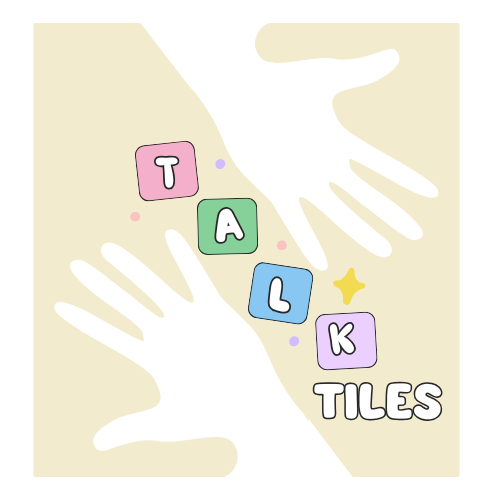

# 🧩 Talk Tiles

An assistive communication app built with **Jetpack Compose**, designed to help children with special needs communicate using visual tiles, emojis, and text-to-speech (TTS).  
**Simple. Colorful. Accessible.**

---



---

## ✨ Features

- 🧒 Kid-friendly UI with emojis and large touch areas  
- 🗣️ Sentence Builder with real-time **Text-to-Speech**
- 📦 Dynamic **Category** and **Word Tiles**
- ❤️ Favorite words for quick access
- ⚙️ Parent Mode with PIN-protected settings
- 🛠️ Full **CRUD**: Add, Edit, Delete Categories and Words
- 🌐 Support for voice, language settings, and data reset
- 📱 100% built using **Jetpack Compose**

---

## 📸 Screenshots

### 🏠 Main Interface

| Home Screen | Category > Word View | Sentence Bar |
|-------------|----------------------|--------------|
|  |  |  |

### ❤️ Favorites and ⚙️ Settings

| Favorites | Settings | Parent Mode Options |
|----------|----------|---------------------|
|  |  |  |

### 🛠️ Manage Data

| Manage Categories | Manage Word Tiles |
|-------------------|-------------------|
|  |  |

> 📸 Place your real screenshots in the `screenshots/` directory and ensure filenames match.

---

## 🏗️ Tech Stack

- 🧩 Jetpack Compose
- 📦 Room Database
- 🎙 Android Text-to-Speech API
- 🧠 MVVM Architecture
- 🧭 Navigation Compose
- 💬 Kotlin

---

## 🔐 Parent Mode

All sensitive features like editing tiles or resetting data are protected by a **Parent PIN dialog**.  
This ensures a safe experience for children while giving parents full control over customization and data.

---

## 🚀 Getting Started

### 1. Clone the Repo

```bash
git clone https://github.com/your-username/talk-tiles.git
cd talk-tiles
